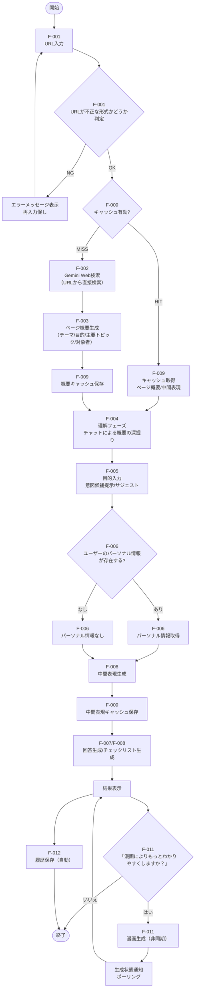

## 1. 機能要件

### 1.1 機能一覧

| ID | 機能名 | 概要 | Phase | 優先度 | 難易度 |
|----|--------|------|-------|--------|--------|
| F-001 | URL入力 | 行政ページのURLを入力し、解析対象を指定する | 1 | 必須 | 低 |
| F-002 | ページ解析 | 指定されたURLからコンテンツを取得・解析する | 1 | 必須 | 高 |
| F-003 | ページ概要提示 | 解析したページで「何が分かるか／何ができるか」の概要を提示する | 1 | 必須 | 中 |
| F-004 | 概要の深掘り | 理解フェーズのチャットで関連トピックや詳細セクションを深掘りできる導線を提供する | 1 | 必須 | 中 |
| F-005 | ユーザー意図入力 | 目的フェーズとして「何を知りたいか」を一文で入力できる導線を提供する | 1 | 必須 | 低 |
| F-006 | 中間表現生成 | ページ内容とユーザーの意図を元に、構造化された中間表現を生成する | 1 | 必須 | 高 |
| F-007 | 回答生成 | 中間表現からユーザーの意図に沿った平易な回答を生成する | 1 | 必須 | 高 |
| F-008 | チェックリスト生成 | ユーザーが次に取るべきアクションのチェックリストを生成する | 1 | 必須 | 中 |
| F-009 | キャッシュ管理 | 解析結果をURL単位でキャッシュする | 1 | 必須 | 中 |
| F-010 | 信頼性担保 | 根拠表示、免責同意、原文リンク、更新日時を提供する | 1 | 必須 | 中 |
| F-011 | 漫画生成 | 中間表現からユーザー主人公の漫画を生成する | 1 | 必須 | 高 |
| F-012 | 履歴管理 | 過去の解析結果を保存・参照する | 2 | 推奨 | 中 |
| F-013 | フィードバック | 生成結果の正確性に関するフィードバックを収集する | 3 | 推奨 | 中 |
| F-014 | ダウンロード | 生成結果をファイルとしてダウンロードする | 2 | 推奨 | 低 |
| F-015 | 共有機能 | 生成結果をSNS等で共有する | 3 | 任意 | 中 |
| F-016 | 音声読み上げ | 回答を音声で読み上げる | 3 | 任意 | 中 |
| F-017 | 多言語対応 | 複数言語での回答生成 | 3 | 任意 | 高 |

### 1.1.1 処理フロー図



### 1.2 機能詳細（Phase 1）

#### F-001 URL入力機能

| 項目 | 内容 |
|------|------|
| 機能概要 | ユーザーが行政ページのURLを入力するインターフェースを提供する |
| 入力 | URL文字列 |
| 出力 | バリデーション結果、解析開始通知 |
| 処理内容 | URLの形式チェック、アクセス可否の確認、対応サイトの判定、キャッシュ有無の確認 |
| 制約事項 | 日本国内の行政サイト（.go.jp、.lg.jp等）を優先対応 |

#### F-002 ページ解析機能

| 項目 | 内容 |
|------|------|
| 機能概要 | 指定されたURLからWebページのコンテンツを取得し、構造を解析する |
| 入力 | 検証済みURL |
| 出力 | 解析済みページデータ（テキスト、構造情報） |
| 処理内容 | HTMLの取得、不要要素の除去、本文抽出、セクション分割。ページ解析後にGeminiのWeb検索処理へ引き継ぐ。 |
| 制約事項 | JavaScriptレンダリングが必要なページへの対応は段階的に実施 |

#### F-003 ページ概要提示機能

| 項目 | 内容 |
|------|------|
| 機能概要 | 解析したページで「何が分かるか／何ができるか」に加え「対象者の目安」を含む概要を提示する |
| 入力 | 解析済みページデータ、GeminiのWeb検索結果 |
| 出力 | ページ概要（Markdown形式） |
| 処理内容 | 解析済みデータとWeb検索結果から、ページ全体のテーマ、目的、主要なトピックに加えて対象者の目安（例: 対象となる住民・事業者・世帯等）を抽出・要約して提示する。 |

#### F-004 概要の深掘り機能

| 項目 | 内容 |
|------|------|
| 機能概要 | 概要を起点に、理解フェーズのチャットで関連トピックや詳細セクションを深掘りできる導線を提供する |
| 入力 | ページ概要、関連トピック候補、詳細セクション候補、理解フェーズのチャット入力 |
| 出力 | 理解フェーズの要点整理、深掘り対象のトピック／セクション |
| 処理内容 | 主要トピックの提示、質問・選択による理解支援、深掘り対象の確定。終了時に要点を短く要約し、その直後に目的入力欄を表示して暗黙的に目的フェーズへ遷移する。必要に応じて継続深掘りの導線として「もう少し深掘りする」を提示する。 |
| 補足 | 意図入力前の理解フェーズとして提供し、目的入力へは暗黙遷移で切り替える。 |

#### F-005 ユーザー意図入力機能

| 項目 | 内容 |
|------|------|
| 機能概要 | 理解フェーズの要点を受けて表示される入力欄で、目的フェーズとして「何を知りたいか」を一文で入力できる導線を提供する |
| 入力 | ユーザーによる目的入力（理解フェーズの要点表示を参照） |
| 出力 | ユーザーの意図（文字列） |
| 処理内容 | 理解フェーズの要点の直後に入力欄を表示し、「知りたいことを一文で」など短文入力を促す。入力されたテキストを後続の中間表現生成機能に渡す。ページ概要と深掘り結果から推定した「意図候補」を最大3件提示し、候補をクリックして目的入力欄に反映するか、自由入力で目的を記述するかを選べるようにする。入力例として複数のサジェストを表示し、例は以下のルールで更新する。（例：「私がもらえる手当について知りたい」「必要な書類を教えて」「申請の手順と期限を教えて」）<br>**ヒント更新ルール**: 画面表示時に3件をランダム表示し、ユーザーが入力欄にフォーカスするたびに再抽選する。ページ概要の主要トピックが取得できている場合は、そのトピックに沿った例を優先表示する。 |

#### F-006 中間表現生成機能

| 項目 | 内容 |
|------|------|
| 機能概要 | 解析結果、ユーザーの意図、ユーザー情報から、LLMを用いて構造化された中間表現を生成する |
| 入力 | 解析済みページデータ、ユーザーの意図（文字列）、ユーザー情報（ユーザーページから取得、任意） |
| 出力 | 中間表現（JSON形式） |
| 処理内容 | 理解フェーズでの深掘り結果と目的入力を反映し、ユーザーの意図とユーザー情報（年齢、居住地、家族構成など）に基づいてページデータから関連性の高い情報を抽出・構造化する。制度名・概要の抽出、対象者条件の特定、手続きフローの整理、必要書類の列挙、例外条件の抽出、根拠箇所のマッピングなどを行う。 |

**中間表現のデータ構造**：

```json
{
  "user_goal": "ユーザーの目的（1文）",
  "focus": {
    "topics": ["深掘りで確定したトピック"],
    "sections": ["深掘りで確定したセクション"]
  },
  "intent_summary": "目的に沿った要点（1-2文）",
  "title": "制度名",
  "summary": "制度の概要（1-2文）",
  "target": {
    "conditions": ["対象条件1", "対象条件2"],
    "exceptions": ["例外条件1"]
  },
  "procedure": {
    "steps": [
      {"order": 1, "action": "手続き1", "details": "詳細"},
      {"order": 2, "action": "手続き2", "details": "詳細"}
    ],
    "required_documents": ["書類1", "書類2"],
    "deadline": "期限情報",
    "contact": {
      "name": "問い合わせ先名",
      "phone": "電話番号",
      "url": "問い合わせURL",
      "hours": "受付時間"
    }
  },
  "benefits": {
    "description": "給付・支援内容",
    "amount": "金額等（該当する場合）"
  },
  "sources": [
    {
      "section": "セクション名",
      "heading_path": ["見出し1", "見出し2"],
      "anchor": "#section-1",
      "excerpt_range": "L120-L135",
      "original_text": "根拠となる原文",
      "source_id": "src-001"
    }
  ],
  "personalization": {
    "questions": [
      {
        "id": "q1",
        "question": "お子さんの年齢は？",
        "type": "select",
        "options": ["0-2歳", "3-5歳", "6-14歳", "15歳以上"],
        "affects": [
          {"path": "target.conditions", "rule": "年齢条件を追加"},
          {"path": "benefits.amount", "rule": "年齢に応じた金額を設定"}
        ]
      }
    ]
  },
  "metadata": {
    "source_url": "元のURL",
    "last_modified": "更新日時（取得できる場合）",
    "fetched_at": "取得日時",
    "cache_expires_at": "キャッシュ有効期限"
  }
}
```

#### F-007 回答生成機能

| 項目 | 内容 |
|------|------|
| 機能概要 | 中間表現からユーザーの意図に沿った平易な言葉の回答を生成する |
| 入力 | 中間表現（JSON） |
| 出力 | 回答ドキュメント（Markdown形式） |
| 処理内容 | 専門用語の平易化、文章の簡潔化、重要ポイントの強調、根拠リンクの付与。ユーザーの意図に合わせて、特に重要な情報を中心に構成する。 |
| 品質基準 | 中学生でも理解できる日本語レベル、原文の正確性を維持、各文に根拠を紐付け |

#### F-008 チェックリスト生成機能

| 項目 | 内容 |
|------|------|
| 機能概要 | ユーザーが次に取るべきアクションを確認できるチェックリストを生成する |
| 入力 | 中間表現（JSON） |
| 出力 | インタラクティブなチェックリスト |
| 処理内容 | 必要な手続きのリスト化、期限の明示、必要書類の一覧化、優先順位付け |

#### F-009 キャッシュ管理機能

| 項目 | 内容 |
|------|------|
| 機能概要 | URL単位で解析結果をキャッシュし、重複処理を削減する |
| 入力 | URL、解析結果 |
| 出力 | キャッシュ済みデータまたはキャッシュミス通知 |
| 処理内容 | URLのハッシュ化、キャッシュ保存・取得、有効期限管理。ページ概要レベルでのキャッシュと、中間表現レベルでのキャッシュを検討する。 |
| キャッシュ期間 | 24〜72時間（コンテンツの更新頻度に応じて調整） |
| 無効化条件 | 元ページの更新検知、手動無効化、期限切れ |

#### F-010 信頼性担保機能

| 項目 | 内容 |
|------|------|
| 機能概要 | 生成された情報の信頼性を担保するための各種機能を提供する |

**サブ機能一覧**：

| サブ機能 | 説明 |
|---------|------|
| 根拠表示 | 回答の各文に「この情報の根拠」リンクを付与。クリックで原文該当箇所をハイライト表示 |
| 更新日時表示 | 「この情報は YYYY/MM/DD 時点のものです」を明示 |
| 免責同意 | 初回利用時に「本サービスは参考情報を提供するものであり、正確性を保証するものではありません。正式な手続きの際は必ず公式情報をご確認ください」への同意を取得 |
| 原文リンク | 常に元の行政ページへのリンクを目立つ位置に配置 |
| フィードバック | 「この情報は正しいですか？」ボタンを設置し、ユーザーからの報告を収集 |

#### F-011 漫画生成機能

| 項目 | 内容 |
|------|------|
| 機能概要 | 中間表現からユーザーを主人公とした漫画形式のコンテンツを生成する |
| 入力 | 中間表現（JSON）、ユーザー設定（任意） |
| 出力 | 漫画画像（複数コマ）またはWebコミック形式（Cloud Storageに保存し参照URLを返却） |
| 処理内容 | シナリオ生成、テンプレート選択、セリフ・ナレーション配置、画像合成、Cloud Storageへ保存 |
| 品質基準 | 4〜8コマ程度で制度の要点を伝達、視認性の高いデザイン |
| 生成方式 | テンプレート方式（キャラクター・背景は固定、セリフを動的生成）を採用しコスト削減 |
| トリガー | 「もっとわかりやすく」ボタンからのオンデマンド生成 |
| 非同期処理 | 生成完了までポーリングまたはプッシュ通知で状態を通知 |

### 1.3 機能詳細（Phase 2）

#### F-012 履歴管理機能

| 項目 | 内容 |
|------|------|
| 機能概要 | ユーザーが過去に閲覧した解析結果を保存・参照できる |
| 入力 | ユーザー識別子、解析結果ID |
| 出力 | 履歴一覧、過去の解析結果 |
| 処理内容 | サーバーサイドでの履歴保存、一覧表示、再閲覧 |
| 保存期間 | 90日間 |

#### F-013 フィードバック機能

| 項目 | 内容 |
|------|------|
| 機能概要 | 生成結果の正確性に関するユーザーフィードバックを収集・分析する |
| 入力 | ユーザーの評価（正確/不正確）、詳細コメント（任意） |
| 出力 | フィードバックレポート、改善対象の特定 |
| 処理内容 | フィードバック収集、集計、問題箇所の特定、プロンプト改善への反映 |
