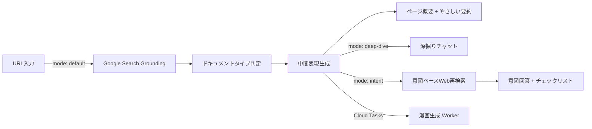

## はじめに

> 制度は「ある」のに、助けが届かない。

児童手当、介護保険、転入届——行政の支援制度はWebページに正確に書かれています。しかし、最も支援を必要とする人ほど、そのページを読み切れずにタブを閉じてしまう。

この **"入口での断念"** を減らすために、**行政ページのURLを貼るだけ** で「やさしい要約」「チェックリスト」「漫画」を自動生成するWebアプリ **KOMANAVI（コマナビ）** を作りました。

:::message
この記事では、KOMANAVIの課題設定・プロダクト設計・システムアーキテクチャを解説します。
:::

---

## 🔍 背景：「正しいのに、届かない」構造

行政ページを開いた人が、長い前提条件と例外に圧倒され、「自分は対象なのか」が確信できないままページを閉じる——この光景は珍しくありません。

**ひとり親、高齢者の介護者、外国人住民、災害被災者。** 緊急性が高く情報弱者になりやすい層ほど、「読んで、理解して、行動に移す」ハードルが高いのが実情です。

### 行政負担（Administrative Burden）の3つのコスト

公共政策研究では、住民が行政と接点を持つ際の負担を **3つのコスト** で整理しています。

| コスト | 意味 | 例 |
|--------|------|-----|
| **Learning（学習）** | 制度を知り、理解する負担 | 長文・専門用語・分散した情報 |
| **Psychological（心理）** | 不安やスティグマ | 「自分が対象か分からない」不安 |
| **Compliance（手続）** | 実際の申請・提出の手間 | 書類集め・窓口訪問 |

重要なのは、**制度の複雑性と情報提示の設計そのものが、構造的な参入障壁になり得る** という点です。

> 参考：[Administrative Burden: Learning, Psychological, and Compliance Costs in Citizen-State Interactions](https://academic.oup.com/jpart/article-abstract/25/1/43/88595)

### データで見る「入口の詰まり」

この問題は感覚ではなく、データとしても観測されています。

**📊 相談件数：年間30万件超**
厚生労働省の速報値によると、生活困窮者自立支援制度の新規相談は令和6年度で **302,670件**。制度の入口で「相談」自体が巨大なボリュームになっています。

> 参考：[生活困窮者自立支援制度における新規相談件数等速報値](https://www.mhlw.go.jp/content/001612625.pdf)

**🏢 窓口DXでも課題認識**
デジタル庁の「自治体窓口DX」資料でも、「必要な申請や書類が分からない」「どの窓口に行くべきか分からない」という住民側の詰まりが明示されています。

> 参考：[自治体窓口DXSaaS概要説明資料](https://www.digital.go.jp/assets/contents/node/information/field_ref_resources/368bf896-1fe4-4c53-bccb-3167cd06eac8/38a6efd9/20251024_news_dxsaas_provide-public-offering_outline_05.pdf)

---

## ❓ 課題：「正確だが、使われない」

行政ページは **「正確性」** を重視して設計されています。一方で、利用者は短時間で次の2点に到達できません。

1. **自分が対象か**（判断）
2. **次に何をすべきか**（行動）

:::message alert
正しいことは書いてある。しかし、文字量が多く、言い回しが難しく、情報が分散しているために、**読まれず使われない**——これが中核課題です。
:::

### なぜ「現場の努力」では解消しないか

膨大な公的ページを、制度改定に追随しながら常に理解しやすい形式で再編集し続けるのは、**人的運用ではスケールしません**。

加えて、公的ページは誤りの影響・責任が大きく、スピード感をもった改善が進みにくいという構造的な制約もあります。

---

## 💡 KOMANAVI：行政情報の「理解の入口」を自動生成する

**KOMANAVI（コマナビ）** は、行政ページのURLを入力するだけで、AIが出典付きの概要・やさしい要約を自動生成するWebアプリケーションです。

さらに **深掘りチャット** や **意図入力** を通じて、ユーザーの目的に最適化された **パーソナライズ回答・チェックリスト・漫画** を提供します。

> 利用者が短時間で内容を自分ごととして理解し、次の一手に進むための「理解の入口」。それがKOMANAVIの目的です。

### なぜ「漫画」なのか

KOMANAVIが漫画を採用するのは、学術的な根拠に基づいています。

| 効果 | 理論・エビデンス |
|------|----------------|
| **学習コストの最短化** | 視覚＋文章の二重チャネルで理解・記憶を支援（[Dual-Coding Theory](https://www.sciencedirect.com/topics/neuroscience/dual-coding-theory)） |
| **心理コスト（不安）の低減** | 漫画的説明が理解を高め不安を低減したRCTの報告あり（[Randomized Trial](https://pubmed.ncbi.nlm.nih.gov/30959523/)） |

---

## 🚀 プロダクト詳細

### 7ステップのガイドフロー

KOMANAVIでは、利用の流れを **7ステップ** に分解し、進捗インジケーターで「今どこにいて、次に何をすればいいか」を常に表示します。

| # | ステップ | 内容 |
|---|---------|------|
| 1 | **URLを解析** | 行政ページのURLを入力し、AIが取得・解析 |
| 2 | **要点を確認** | 構造化されたページ概要を確認 |
| 3 | **深掘りする**（任意） | チャット形式で気になるトピックを掘り下げ |
| 4 | **意図を入力** | 「実現したいこと」を一文で入力 |
| 5 | **漫画で確認** | 4〜8コマの漫画で直感的に理解 |
| 6 | **あなた向けの回答を作成** | パーソナライズされた回答を生成 |
| 7 | **チェックリストを確認** | 次に取るべきアクションを確認 |

URLを貼るだけで始められるシンプルな導線で、ITに不慣れなユーザーでも迷わず利用できることを重視しています。

---

### 機能 1：ページ概要 —— 行政ページを1分で把握

AIがGoogle Search Groundingを活用してページ内容を取得し、以下の構造で概要を生成します。

| 表示項目 | 内容 |
|---------|------|
| 📌 **30秒で把握** | ページ全体の結論を1文で |
| 👤 **だれ向けの情報か** | 対象者の目安 |
| ✅ **実現できること** | 具体的な成果（最大3件） |
| ⚡ **最重要ポイント** | 制度利用に直結する事実を表形式で |
| ⚠️ **注意点** | 期限・例外条件など |
| 📞 **問い合わせ情報** | 電話番号・窓口・受付時間 |

すべての情報に **証跡URL（出典）** が紐づいており、AIの根拠を常に確認できます。

---

### 機能 2：深掘りチャット ＆ 意図入力

概要を確認した後、2つの方法でさらに深く知ることができます。

#### 💬 深掘りチャット

概要を起点にチャット形式で掘り下げます。20件を超えるメッセージは自動要約され、文脈を維持したまま会話を続けられます。

#### 🎯 意図入力

「児童手当の申請方法が知りたい」のように、目的を一文で入力します。すると **Google Search Groundingによる意図ベースのWeb再検索** が実行され、ユーザーの意図に最適化された回答を新たに生成します。

:::message
単に既存の情報を並べ替えるのではなく、**意図に合わせて追加情報を収集し直す** 点がポイントです。
:::

生成される回答の構造：

- **結論**：最終判断を一文で
- **最初にやるべきこと**：最優先アクション
- **失敗リスク**：見落とすと困るポイント

Myページにプロフィール（年齢・職業・居住地など）を登録していれば、属性に応じた出し分けも自動で行われます。

---

### 機能 3：チェックリスト —— 次の行動を明確に

意図入力の結果をもとに、次に取るべきアクションを **最大15項目・時系列順** で生成します。

- 各項目にカテゴリ（書類準備・手続き・確認事項）と優先度を付与
- 重要な項目は「重要」バッジで強調
- プログレスバーで完了率を可視化
- チェック状態は保存され、途中から再開可能

---

### 機能 4：漫画 —— 直感的に理解

Gemini の画像生成モデルで **4〜8コマの漫画** を自動生成します。コマ数とコマの内容は、ドキュメントの種類に応じて自動で最適化されます。

| ドキュメントの種類 | コマの構成例 |
|-----------------|------------|
| 給付制度 | 金額 → 対象者 → 期限 |
| 手続き系 | 手順 → 必要書類 → 期限 |
| 共通 | 注意事項・よくある失敗パターンを優先的に掲載 |

Myページで登録した外見の特徴や性格を反映し、**ユーザー自身を主人公にしたパーソナライズ漫画** を生成できます。漫画生成は非同期処理のため、待っている間も他の情報を確認できます。

---

### 機能 5：信頼性の担保

AIの情報を鵜呑みにしないための仕組みを、プロダクト全体に組み込んでいます。

- **根拠表示**：すべての生成結果に原文の出典を表示
- **免責事項**：「参考情報であること」を明示するバナーとモーダル
- **Google Search Attribution**：検索クエリと参照元URLをUI上に表示（Google利用規約準拠）

---

### 機能 6：会話履歴

ログインユーザーの解析結果はCloud Firestoreに自動保存され、サイドバーからいつでも再参照できます。

- 概要・チェックリスト・意図回答・漫画を一括保存
- チェックリストの進捗も保持（途中から再開可能）
- ページ離脱時も `keepalive` 対応APIで確実に保存

---

## 🏗️ システムアーキテクチャ

### 全体構成


### 技術スタック

| カテゴリ | 技術 |
|----------|------|
| **フロントエンド** | Next.js 16.1.1 / React 19.2.3 / Tailwind CSS 4 |
| **状態管理** | Zustand 5 |
| **AI SDK** | @google/genai（Vertex AI 経由） |
| **AI（解析）** | Gemini 3.0 Flash + Google Search Grounding |
| **AI（漫画生成）** | Gemini 3.0 Pro Image |
| **認証** | NextAuth v5 + Firebase Auth |
| **DB** | Cloud Firestore |
| **ストレージ** | Cloud Storage |
| **非同期処理** | Cloud Tasks + Cloud Run Worker（Express.js） |
| **デプロイ** | Cloud Run（asia-northeast1）/ Node.js 20 |
| **CI/CD** | Cloud Build → Artifact Registry → Cloud Run |

### データフロー

すべてのAI処理は単一のエンドポイント `/api/analyze` に統合され、`mode` パラメータで分岐します。



**中間表現（IntermediateRepresentation）** がパイプラインの中核を担い、ドキュメントの種類（6種類：benefit / procedure / information / faq / guide / other）に応じた構造で情報を保持します。この中間表現から要約・チェックリスト・漫画がそれぞれ独立に生成される設計です。

:::details データフローの詳細（テキスト版）
```
[1] URL入力（mode: default）
  → Google Search Grounding（ページ内容取得）
  → ドキュメントタイプ判定（6種類）
  → 中間表現生成（構造化JSON）
  → ページ概要 + やさしい要約の並列生成

[2] 深掘りチャット（mode: deep-dive）
  → 中間表現 + チャット履歴をコンテキストとしてLLM呼び出し
  → 20件超のメッセージは自動要約で文脈を圧縮

[3] 意図入力（mode: intent）
  → Google Search Groundingによる意図ベースWeb再検索
  → 意図回答 + チェックリスト（mode: checklist）の並列生成

[4] 漫画生成（Cloud Tasks 経由で非同期）
  → ドキュメントタイプに応じたパネル構成を自動決定
  → Gemini Pro Image で4〜8コマの漫画を生成

[5] 会話履歴の自動保存（Firestore）
```
:::

---

### Cloud Run によるゼロスケール構成

2つのCloud Runサービスで構成しています。

| サービス | 役割 | 構成 |
|---------|------|------|
| **komanavi** | Next.js（standalone） | フロントエンド兼APIサーバー |
| **komanavi-worker** | Express.js | 漫画生成専用（512Mi / タイムアウト600秒） |

Cloud Runはリクエストがないときインスタンスを **0にスケールダウン** できるため、PoCフェーズのコストを最小限に抑えています。

---

### Google Search Grounding への移行

当初はCheerioによるHTMLスクレイピングでしたが、以下の課題から **Google Search Grounding** に完全移行しました。

| 課題 | Search Groundingでの解決 |
|------|------------------------|
| PDFなどHTML以外の形式に非対応 | Web検索経由で形式を問わず取得 |
| JSレンダリングが必要なページ | Googleの検索インフラで解決 |
| 文脈情報の欠落 | 検索結果として文脈付きで取得 |

URLを指定するだけでGeminiがWeb検索を通じてページ内容を取得し、参照元URLやクエリも自動記録されます。これが出典表示の基盤にもなっています。

---

### 漫画生成の非同期アーキテクチャ

漫画生成はGemini Pro Imageの画像生成を伴い処理時間が長いため、非同期パイプラインを構築しています。

:::details 漫画生成パイプラインの詳細（7ステップ）
1. メインアプリが Firestore（`conversation_manga`）にジョブ作成 → Cloud Tasks にエンキュー
2. Cloud Tasks が Worker にOIDC認証付きHTTPリクエスト送信
3. Worker がドキュメントタイプに応じたパネル構成を決定（4〜8コマ）
4. Gemini Pro Image に `responseModalities: ['TEXT', 'IMAGE']` で生成リクエスト
5. Cloud Storage にアップロード（`users/{userId}/manga/{timestamp}-{uuid}.png`）
6. Firestore のジョブステータスをリアルタイム更新（30% → 50% → 70% → 85% → 100%）
7. クライアントが2秒間隔でポーリング → 署名付きURL（60分TTL）で画像を表示
:::

ユーザーは漫画の生成を待つ間も、要約やチェックリストを確認できます。同一ユーザーの並行ジョブ制限・日次使用量制限により、リソースの公平な利用を確保しています。

---

## 🎨 設計で大切にしたこと

### 1. 「やさしい日本語」の徹底

すべてのAIプロンプトに以下の制約を組み込んでいます。

> 専門用語はそのまま残さず、必要なら言い換える（例：「受給資格」→「受け取れる条件」）

ターゲットユーザーの第1優先は **ひとり親・高齢者の介護者・外国人住民・災害被災者** であり、フォントサイズ18px以上・高コントラストのUIを採用しています。

### 2. 原文への根拠参照を常に表示

AIが生成した情報には、必ず出典を紐づけています。利用者が「本当にそう書いてあるのか」を自分で確認できる構造です。

### 3. 7ステップのガイドフローで「迷わせない」

行政情報の理解を7つのステップに分解し、進捗インジケーターで現在地を常に表示しています。各ステップの状態は30以上のコンテキストフラグから自動判定されるため、ユーザーが手動管理する必要はありません。

### 4. パーソナライズの設計

ユーザープロフィールは8項目で構成されています。

| プロフィール項目 | AI生成での活用 |
|----------------|--------------|
| 年齢・職業・居住地 | 制度の該当可能性を優先的に提示 |
| 国籍・居住地 | 手続きの分岐を反映 |
| 外見の特徴・性格 | 漫画のキャラクターに反映 |
| 表示名 | 漫画の主人公名に使用 |

すべてのLLMプロンプトに共通のパーソナライズブロックを注入する設計としており、新機能追加時にも一貫したパーソナライズが適用されます。

---

## おわりに

行政の情報は「正確に書かれている」ことがほとんどです。しかし、最も支援を必要とする人ほど、その正確な情報に到達できないまま断念している——この構造的なギャップが、KOMANAVIが解きたい課題です。

**URLを貼るだけで「自分が対象か」「次に何をすべきか」がわかる。** 原文の出典が常に確認できる。漫画で直感的にイメージできる。

KOMANAVIが、行政情報の「理解の入口」として、制度と人との距離を少しでも縮められればと思っています。
