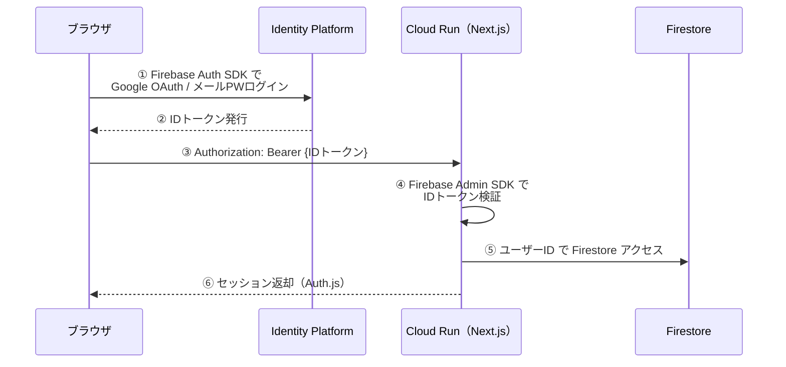
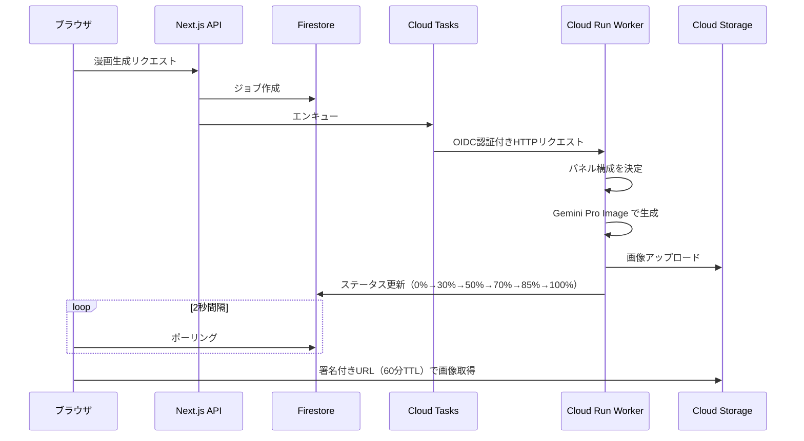

## はじめに

あなたが最後に行政のWebページを読んだのは、いつですか？

人生の転機——引っ越し、出産、介護——で「使える制度があるはず」と検索したのに、結局よく分からないまま画面を閉じた経験は、多くの人にあるはずです。

私自身、引っ越し手続きを調べていて「窓口で聞いたほうが早い」と諦めた経験があります。ITに慣れた自分ですらそうなのだから——**子育て世帯、高齢者、外国人住民、災害被災者にとって、このハードルはどれほど高いのか。**

この **"入口での断念"** を、テクノロジーの力で解決できないか——それが本記事で紹介する **KOMANAVI（コマナビ）** の出発点です。

## KOMANAVI イメージ4コマ漫画

## KOMANAVI デモ動画


## 🔍 背景：「正しいのに、届かない」構造

### ある「子育て世帯」の体験

想像してみてください。子どもが生まれたばかりの親が、「どんな支援を受けられるのか」を調べようとする場面を。

1. 市の公式サイトを開く
2. 「児童手当」「児童扶養手当」「乳幼児医療費助成」——似た名前の制度が複数ヒットする
3. あるページを開くと、所得制限の計算式、「扶養親族等の数」による場合分け、「〇〇法第△条に規定する…」という但し書き
4. 3つ目のタブを開いた時点で、**「自分が対象なのか」すら分からないまま、ブラウザを閉じる**

これは架空のシナリオではありません。行政情報は「正確であること」が最優先で設計されており、その正確性こそが **読まれない原因** になっているのです。

### 行政負担（Administrative Burden）の3つのコスト

公共政策研究では、住民が行政と接点を持つ際の負担を **3つのコスト** で整理しています。

| コスト | 意味 | 行政ページでの典型例 |
|--------|------|-----|
| **Learning（学習）** | 制度を知り、理解する負担 | 長文・専門用語・分散した情報。「自分が対象か」の判断に到達できない |
| **Psychological（心理）** | 不安やスティグマ | 「読んでも分からない自分が悪い」という自責。窓口に行くこと自体の心理障壁 |
| **Compliance（手続）** | 実際の申請・提出の手間 | 書類集め・窓口訪問・平日のみの受付 |

とりわけ **Learning（学習）** と **Psychological（心理）** の2つは、情報に触れる「入口」で発生するため、そもそも制度を利用するスタートラインに立てないという深刻な影響を持ちます。

> 参考：[Administrative Burden: Learning, Psychological, and Compliance Costs in Citizen-State Interactions](https://academic.oup.com/jpart/article-abstract/25/1/43/88595)

### データで見る「入口の詰まり」

この問題は体感だけでなく、データとしても観測されています。

#### 📊 相談件数：年間30万件超

厚生労働省の速報値によると、生活困窮者自立支援制度の新規相談は令和6年度で **302,670件**。

- 制度の入口で「相談する」という行為自体が巨大なボリュームになっている
- つまり **30万人が「ページを読んでも分からなかった」から窓口に来ている** 可能性がある

> 参考：[生活困窮者自立支援制度における新規相談件数等速報値](https://www.mhlw.go.jp/content/001612625.pdf)

#### 🏢 窓口DXでも課題認識

デジタル庁の「自治体窓口DX」資料でも、住民側の詰まりが明示されています。

- 「必要な申請や書類が分からない」
- 「どの窓口に行くべきか分からない」

> 参考：[自治体窓口DXSaaS概要説明資料](https://www.digital.go.jp/assets/contents/node/information/field_ref_resources/368bf896-1fe4-4c53-bccb-3167cd06eac8/38a6efd9/20251024_news_dxsaas_provide-public-offering_outline_05.pdf)


## ❓ 課題：「正確だが、届かない」をどう解くか

背景で見てきたように、行政情報の課題構造は明確です。

:::message alert
文字量が多く、言い回しが難しく、情報が分散しているために、**「自分が対象か」と「次に何をすべきか」に到達できないまま離脱してしまう**——これが中核課題です。
:::

では、この「入口の詰まり」を解消する方法はないのでしょうか。既存のアプローチを検討すると、いずれも構造的な限界を抱えています。

- **人手でページを書き直す** → 制度改定のたびに再編集が必要で、改善スピードが出ない
- **ChatGPT等に聞く** → 「何を聞けばいいか」が分からない人は、プロンプトを書くこと自体がハードル
- **AIで要約だけ出す** → 「ふーん」で終わり、判断と行動に到達できない

この3つの限界を同時に突破するにはどうすればいいのか——その答えがKOMANAVIです。


## 💡 解決策：KOMANAVI

KOMANAVIは、**行政ページのURLを貼るだけ** で「やさしい要約」「チェックリスト」「漫画」を自動生成するWebアプリです。

前章で挙げた3つの限界に対し、以下のように応えます。

| 既存の限界 | KOMANAVIの解決策 |
|-----------|--------------|
| 人手で書き直す → 改定に追随できない | **人手不要** — AIがリアルタイムに解析。制度改定にも自動追随 |
| ChatGPT等 → プロンプトが書けない | **質問不要** — URLを貼るだけ。プロンプトを考える必要がない |
| AI要約だけ → 「ふーん」で終わる | **要約で終わらない** — 意図入力→漫画 / 回答 / チェックリストまで一気通貫 |

### なぜ「漫画」を解決策の柱にしたのか

「行政情報に漫画？」と思われるかもしれません。しかし、これは学術的な根拠に基づいた設計判断です。

| 課題 | 漫画の効果 | 理論・エビデンス |
|------|-----------|----------------|
| **読むのが大変** | 視覚＋文章の二重チャネルで理解・記憶を支援 | [Dual-Coding Theory](https://www.sciencedirect.com/topics/neuroscience/dual-coding-theory) |
| **不安で読めない** | 漫画的説明が理解を高め不安を低減 | [Randomized Trial](https://pubmed.ncbi.nlm.nih.gov/30959523/) |
| **自分ごとにならない** | 「自分が主人公」のパーソナライズ漫画 | KOMANAVIの独自設計 |

前述の行政負担コストでいえば、Learning（学習）と Psychological（心理）を漫画で同時に下げる——これがKOMANAVIの核心的な仮説です。


## 🚀 プロダクト詳細

### 7ステップのガイドフロー

行政情報の理解を「流れ」として設計しました。KOMANAVIでは、利用の流れを **7ステップ** に分解し、進捗インジケーターで「今どこにいて、次に何をすればいいか」を常に表示します。

| # | ステップ | 内容 | 対応する行政負担コスト |
|---|---------|------|------|
| 1 | **URLを解析** | 行政ページのURLを入力し、AIが取得・解析 | — |
| 2 | **要点を確認** | 構造化されたページ概要を確認 | Learning ↓ |
| 3 | **深掘りする**（任意） | チャット形式で気になるトピックを掘り下げ | Learning ↓ |
| 4 | **意図を入力** | 「実現したいこと」を一文で入力 | — |
| 5 | **漫画で確認** | 4〜8コマの漫画で直感的に理解 | Learning ↓ Psychological ↓ |
| 6 | **あなた向けの回答を作成** | パーソナライズされた回答を生成 | Learning ↓ Psychological ↓ |
| 7 | **チェックリストを確認** | 次に取るべきアクションを確認 | Compliance ↓ |


### 機能 1：ページ概要 —— 行政ページを1分で把握

AIがGoogle Search Groundingを活用し、対象ページに関する情報をGoogle検索で収集・合成して、以下の構造で概要を生成します。

| 表示項目 | 内容 |
|---------|------|
| 📌 **30秒で把握** | ページ全体の結論を1文で |
| 👤 **だれ向けの情報か** | 対象者の目安 |
| ✅ **実現できること** | 具体的な成果（最大3件） |
| ⚡ **最重要ポイント** | 制度利用に直結する事実を表形式で |
| ⚠️ **注意点** | 期限・例外条件など |
| 📞 **問い合わせ情報** | 電話番号・窓口・受付時間 |

すべての情報に出典が紐づいています（詳しくは「機能6：信頼性の担保」で後述）。


### 機能 ２：深掘りチャット ＆ 意図入力 —— 「自分ごと」に変換する

概要を確認した後、2つの方法でさらに深く知ることができます。

#### 💬 深掘りチャット

概要を読んで「ここ、もう少し詳しく知りたい」と思った箇所を、**ページを離れずにその場で掘り下げられる** チャット機能です。

#### 🎯 意図入力 —— ここがKOMANAVIの核心

「児童手当の申請方法が知りたい」のように、目的を一文で入力します。すると既存の情報を並べ替えるのではなく、**Google Search Groundingで意図に合った情報をWebから収集し直し**、最適化された回答を新たに生成します。

### 機能 ３：漫画で確認 —— 自分を主人公にして直感的に理解

Gemini 3.0 Pro Image が中間表現を読み取り、**4〜8コマの漫画** を自動生成します。

- **コマ構成はモデルが自律決定** — 何を・どの順で描くかをページの性質に応じて最適化
- **自分が主人公になる** — Myページのプロフィールで外見・性格をカスタマイズ
- **非同期生成** — 待っている間も要約やチェックリストを確認可能

「他人事」だった行政情報が、自分の姿で描かれることで **「自分ごと」** に変わる——心理コスト低減を狙った設計です。


### 機能 4：回答 & チェックリスト —— 「理解」を「行動」に変換する

#### 🎯 パーソナライズ回答（4ブロック構造）

意図入力をもとに生成される回答は、4ブロックに圧縮されます。

| ブロック | 内容 |
|---------|------|
| **結論** | 回答の要点を一文で即座に把握 |
| **あなたは対象になりそうですか？** | 該当可能性をYes/Noで判断 |
| **最優先の1手** | 最初にやるべきアクション |
| **見落とすと申請で困るポイント** | 期限切れ・書類不備などのリスクを事前警告 |

#### ✅ チェックリスト

意図入力と同時に、中間表現＋ユーザーの意図テキスト＋プロフィールから、次に取るべきアクションを **最大15項目・時系列順** で生成します。

- カテゴリ（書類準備・手続き・確認事項）と優先度を自動付与
- 重要項目は「重要」バッジで強調し、プログレスバーで完了率を可視化
- チェック状態は保存され、途中から再開可能


### 機能 5：Myページ —— すべての出力を「自分向け」に

プロフィール（年齢・職業・居住地・国籍・外見・性格など）を登録すると、**回答・チェックリスト・漫画のすべてが自動でパーソナライズ**されます。

- 例えば外国籍の方には在留カード関連の項目が追加され、漫画では登録した外見・性格が主人公に反映される
- **属性に応じて提示する情報の優先順位が変わる** ため、同じURLでもユーザーごとに異なる結果を返します


### 機能 6：信頼性の担保 —— AIを「鵜呑み」にさせない

AIが生成した情報から、いつでもワンクリックで一次情報（行政の原文ページ）にアクセスできる仕組みを組み込んでいます。

| 仕組み | 内容 |
|--------|------|
| **出典の明示** | すべての生成結果にGoogle Search Groundingの参照元URL・検索クエリを表示。根拠をワンクリックで確認可能。 |
| **免責事項** | 「参考情報であること」を明示するバナーとモーダル |


### 機能 7：会話履歴 —— 途中から再開できる

ログインユーザーの解析結果はCloud Firestoreに自動保存され、サイドバーからいつでも再参照できます。

- 概要・チェックリスト・意図回答・漫画を一括保存
- チェックリストの進捗も保持（途中から再開可能）
- ページ離脱時も `keepalive` 対応APIで確実に保存

行政手続きは「一度で完結しない」ことが多いため、**中断と再開を前提にした設計** です。


## システムアーキテクチャ
本プロダクトは以下の Github で管理されています

### 全体構成


| カテゴリ | 技術 | 選定理由 |
|----------|------|----------|
| **フロントエンド** | Next.js 16 / React 19 / Tailwind CSS 4 | App Router + standalone出力でCloud Run最適化 |
| **状態管理** | Zustand 5 | 7ステップフローの複雑な状態を単一ストアで管理 |
| **AI SDK** | @google/genai（Vertex AI 経由） | Google Search Grounding対応 |
| **AI（解析）** | Gemini 3.0 Flash + Google Search Grounding | 低コスト＋Grounding Metadata取得 |
| **AI（漫画生成）** | Gemini 3.0 Pro Image | テキスト＋画像の同時生成 |
| **認証** | NextAuth v5 + Firebase Auth（Identity Platform） | Google認証＋Firestore連携 |
| **DB** | Cloud Firestore | スキーマレスで高速イテレーション |
| **ストレージ** | Cloud Storage | 署名付きURLで漫画画像を安全に配信 |
| **非同期処理** | Cloud Tasks + Cloud Run Worker | 漫画生成の長時間処理をオフロード |
| **CI/CD** | Cloud Build → Artifact Registry → Cloud Run | devブランチへのpushで両サービスを並列ビルド＆自動デプロイ |


### 認証：GCP Identity Platform + Auth.js

このアプリでは、認証をGoogle Cloudのサービスで統一しています。ブラウザ側では **Firebase Auth SDK** がGoogle OAuth またはメール/パスワード認証を処理し、バックエンドの実体は **GCP Identity Platform** です。

ログイン後に発行されるIDトークンは、Cloud Run上の **Firebase Admin SDK** でサーバーサイド検証します。Auth.js（NextAuth v5）がセッション管理を担い、Cloud Runではサービスアカウント認証が自動適用されるため、APIキーの管理が不要になっています。



> 参考：[GCP Identity Platform パターン集](https://zenn.dev/google_cloud_jp/articles/idp-patterns)


### 「スクレイピングしない」という判断

当初はHTMLスクレイピングで行政ページの内容を取得していましたが、PDF・JSレンダリング・自治体ごとのHTML構造差異といった壁に直面し、「自前でスクレイピングするアプローチは本質的に無理がある」と判断しました。

そこで発想を転換——**自分でページをスクレイピングするのではなく、Googleの検索インフラに情報収集を任せる**。Gemini API の `tools: [{ googleSearch: {} }]` を指定するだけで、Geminiが自動的に検索クエリを生成・実行し、対象ページに関する情報をGoogleのインデックスから収集・合成してくれます。PDFやSPAの中身もGoogleがクロール済みであれば対応可能です。

> 参考：[Google 検索によるグラウンディング（Gemini API ドキュメント）](https://ai.google.dev/gemini-api/docs/grounding)


### 漫画生成の非同期パイプライン

#### 課題：漫画生成は重い

Gemini Pro Imageによる漫画生成は、1リクエストあたり **30秒〜2分** かかります。これを同期的なAPIレスポンスとして処理すると、ユーザーはその間ずっとローディング画面を見続けることになります。

#### 解決策：専用Workerへの非同期オフロード

そこで、漫画生成を専用のCloud Runサービスに切り出し、完全に非同期化しました。

| サービス | 役割 | 構成 |
|---------|------|------|
| **komanavi** | Next.js（standalone） | フロントエンド兼APIサーバー |
| **komanavi-worker** | Express.js | 漫画生成専用 |

メインアプリはCloud Tasks経由でWorkerにジョブを投げるだけ。ブラウザはFirestoreへの進捗ポーリングで完了を検知し、生成された画像を署名付きURLで取得します。



### CI/CD —— Cloud Build による自動デプロイ

`dev` ブランチへのpushをトリガーに、Cloud Buildが2つのサービスを**並列にビルド・デプロイ**します。

```
[dev ブランチへの push]
  ├─ build-main ─→ push ─→ deploy komanavi
  └─ build-worker ─→ push ─→ deploy komanavi-worker
```

1つの `cloudbuild.yaml` に全ステップを集約し、`waitFor` による並列制御でデプロイ時間を最小化。コードをマージするだけで本番環境が更新されるため、PoCフェーズに不可欠な**高速イテレーション**を実現しています。


## 🔮 今後の展望

KOMANAVIは現在PoCフェーズですが、「入口の詰まり」を解消するという使命はここで終わりではありません。行政負担の3コスト（Learning・Psychological・Compliance）をさらに引き下げるために、以下の展開を計画しています。

### 多言語対応 —— 「やさしい日本語」から「やさしい多言語」へ

KOMANAVIの第1優先ターゲットには **外国人住民** が含まれています。出入国在留管理庁の統計によれば、在留外国人数は約340万人（2024年6月末時点）に達しており、行政情報の言語バリアは年々深刻化しています。

現在の「やさしい日本語」を起点に、在留外国人の上位国籍に対応する言語から優先的に展開予定です。

| 優先度 | 言語 | 選定根拠 |
|--------|------|----------|
| 第1波 | 英語・中国語・ベトナム語 | 在留外国人数の上位3カ国語 |
| 第2波 | 韓国語・ポルトガル語・ネパール語 | 定住者・技能実習生の主要言語 |


> 参考：[在留外国人統計（出入国在留管理庁）](https://www.moj.go.jp/isa/policies/statistics/toukei_ichiran_touroku.html)

### ユーザーテストの実施 —— 仮説を検証し、プロダクトを磨く

現在のKOMANAVIは「作り手の仮説」に基づいて設計されています。しかし、**本当に「入口の詰まり」を解消できているかは、実際のユーザーにしか検証できません。**

| フェーズ | 対象 | 検証したいこと |
|----------|------|---------------|
| α テスト | 子育て支援団体・外国人支援NPO | 要約・漫画が「理解の入口」として機能するか |
| β テスト | 実際の行政手続き利用者 | チェックリストが「次の一歩」につながるか |
| 定量評価 | 両グループ | 理解度・行動転換率の変化を測定 |

特に重視しているのは、**「KOMANAVIを使った後に、実際に窓口へ行けたか・申請できたか」** という行動変容の測定です。「わかりやすかった」という感想だけでなく、Complianceコストの低減まで追跡することで、プロダクトの本質的な価値を検証します。


## おわりに

行政の情報は「正確に書かれている」ことがほとんどです。しかし、最も支援を必要とする人ほど、その正確な情報に到達できないまま断念してしまう——開発を進めるなかで、この構造的なギャップの根深さを改めて実感しました。

**制度はある。情報もある。でも、届かない。**

もちろん、行政の窓口で住民一人ひとりに寄り添う職員の方々の存在は、AIにどれだけ大きな技術革新が起きても代替できるものではありません。KOMANAVIが目指しているのは、**支援にたどり着くまでの「入口」をAIの力で少しでも広げること** です。

KOMANAVIはまだPoCフェーズの小さなプロダクトにすぎません。それでも、支援を必要とする方が適切な制度に一歩でも近づける——そんな社会の実現に少しでも貢献できればと思っています。
